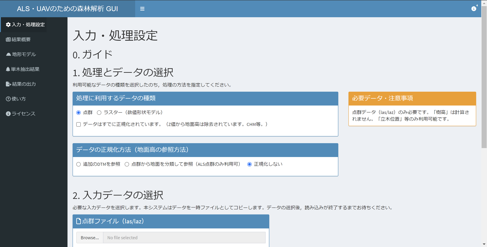

# 森林解析のためのGUIツール（α版）
:::note warn
α版です。タイミングによっては動作が不安定です。

## 概要
従来よりCUI（プログラミング）によって、専門家・研究者に利用されてきたRのパッケージ"lidR"を中心に森林解析ソフトウェアをGUIで操作可能にしたものです。有料や専門知識を有する森林解析ソフトウェアが多い中、だれでも気軽に森林解析を試すことができるようことを目指して作成しています。処理技術は各内部ソフトウェアに依存していますが、オープンソースであり、無料で利用することが可能です。
航空機レーザー計測（ALS）によって取得した樹幹高モデル（Crown Height Model: CHM）に対する処理だけでなく、生点群・表層高モデル（Digital Surface Model: DSM）・地上高モデル（Digital Elevation Model: DEM）等お手持ちのデータから選択可能なように設計されています。また、ALSだけでなく、UAV写真測量によって取得したDSMのみを用いた処理も可能です。
算出可能な情報は、利用可能なデータの種類に依存します。いずれのデータであっても単木抽出（立木マップの作製）・樹木特性の測定（樹幹面積等）が可能です。CHMもしくはALS生点群やDSM・DEMのセットが利用可能な場合は、樹高の算出をすることができます。

## 利用情報
R上で利用可能なGUI作成ソフトウェア"Shiny"を用いており、ブラウザー上でオフラインで動作するものの、現状ではRの環境が必要です。
今後、"Electron"によるスタンドアロン版を作成する予定です。

## その他・更新情報
* 開発者の多忙につき、非常にゆっくりと開発を進めています。
* 機械学習等によるDBH・バイオマス量推定機能も搭載予定です。
* ひとまずの機能追加が終了するまで（α版）では、開発環境をそのまま最新版として公開しています。β版になるまでは、バージョンによっては実行できない恐れがあります。

## 主に利用しているソフトウェア
* lidR (GPL-3.0): https://cran.r-project.org/package=lidR
* terra (GPL-3.0): https://cran.r-project.org/web/packages/terra/index.html
* shiny (GPL-3.0): https://shiny.posit.co/
